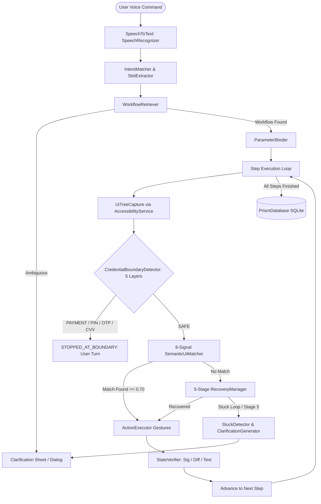

# ANTIGRAVITY.md
# Samsung PRISM GenAI Hackathon 3.0 — Theme 3: Teachable Voice Automation (SaySo)

---

# PART 1: FULL SYSTEM DESIGN

## 1. Executive Summary & Problem Context
Mobile users repeatedly perform the same multi-step app interactions (e.g. food ordering, rides, recurring checkouts) through manual taps. Today's commercial voice assistants fail to solve this because:
1. **API / SDK Dependency**: They require proprietary partner SDKs or deep links. If an app updates its interface or lacks a partner API, voice automation fails.
2. **Fragility & Zero Generalization**: Script-based bots break on layout shifts, ads, or dynamic items, and cannot generalize beyond fixed hardcoded commands.
3. **Unsafe Payment Handling**: Existing tools risk capturing credentials or blindly tapping payment buttons.

**SaySo (PRISM)** solves this by allowing users to **teach any multi-step task once** across arbitrary third-party apps by speaking a command and tapping naturally. SaySo:
- Captures live UI interactions via Android's native `AccessibilityService`.
- Filters out accidental touches and system interruptions (e.g. incoming phone calls).
- Synthesizes a generalized, parameterized, semantic workflow schema (storing slot tokens instead of hard-coded values).
- Persists workflows locally in a Room SQLite database.
- Autonomously replays workflows when requested via exact utterances, colloquial paraphrases, or altered parameter slots (items, quantities, addresses).
- Enforces an absolute, zero-touch halt before any payment or credential screen (**saving the critical -10 penalty on T11**).

---

## 2. Core Architectural Principles
* **Zero App-Specific SDKs**: No proprietary partner SDKs (e.g., zero Zomato, Amazon, or Swiggy SDKs).
* **Zero Deep Links**: Interactions occur purely through native accessibility gestures on the UI tree.
* **Zero Web Fallbacks**: 100% native Android Kotlin implementation.
* **Zero Hard-Coded Flow Scripts**: Workflows are dynamically learned from user demonstrations.
* **Strict Credential & Payment Boundary Handoff**: Guaranteed zero touches or clicks on any payment, OTP, PIN, CVV, or login screen.
* **Semantic Hierarchy Matching**: Matches elements using an 8-signal weighted hierarchy; coordinate-only matching is strictly de-prioritized ($w_8=0.02$).

---

## 3. High-Level System Architecture & Data Flow



---

## 4. Finite State Machine (FSM)

The execution engine is governed by a strict finite state machine with bounded retry and timeout guards:

```
[IDLE]
  │
  ├─► [TEACHING] ──► [LEARNING_CONFIRMATION] ──► [READY]
  │
  └─► [MATCHING_INTENT]
        │
        ├─► (confidence >= 0.80) ──────────► [EXTRACTING_SLOTS]
        ├─► (0.45 <= confidence < 0.80) ───► [AMBIGUOUS_INTENT] ──► Clarify / User Select
        └─► (confidence < 0.45) ──────────► [UNKNOWN_INTENT] ───► Offer to Teach
```

### Complete State Descriptions
1. **IDLE**: Engine is resting, awaiting user voice or manual trigger.
2. **TEACHING**: User is demonstrating a workflow; `TeachingRecorder` captures accessibility events.
3. **LEARNING_CONFIRMATION**: Review sheet presents synthesized steps and slot chips for user confirmation.
4. **READY**: Workflow is validated, parameterized, and active in the database.
5. **RETRIEVING / MATCHING_INTENT**: `IntentMatcher` matches spoken utterance against stored workflows using token Jaccard (50%), Levenshtein (35%), and slot coverage (15%).
6. **EXTRACTING_SLOTS**: `SlotExtractor` resolves variable entities (`item`, `quantity`, `restaurant`, `platform`, `address`).
7. **BINDING**: `ParameterBinder` binds dynamic slot values into step targets and transitions.
8. **EXECUTING_STEP**: `ActionExecutor` dispatches clicks, text entries, or scroll gestures.
9. **VERIFYING_STATE**: `StateVerifier` validates that the screen signature changed, post-state diff is non-empty, and expected substrings appeared.
10. **RECOVERING**: `RecoveryManager` executes bounded 5-stage recovery on unexpected UI.
11. **ASKING_USER**: System is stalled or ambiguous; presents multi-modal question with candidates.
12. **STOPPED_AT_BOUNDARY**: Execution reached a payment, OTP, PIN, or CVV screen; system safely halts and prompts the user.
13. **COMPLETED**: All steps successfully verified; run logged to Room.
14. **FAILED**: Execution exceeded retry budget or unrecoverable error occurred.

---

## 5. UI Matching Engine: The 8-Signal Weighted Hierarchy

`SemanticUiMatcher` calculates candidate node scores ($S \in [0.0, 1.0]$) using an 8-signal hierarchy:

$$\text{Score} = \sum_{i=1}^{8} w_i \cdot s_i$$

| Signal | Weight ($w_i$) | Attribute Evaluated | Scoring Logic |
|---|---|---|---|
| **$w_1$** | **0.30** | Exact Resource ID | `1.0` for exact match; `0.75` for matching ID suffix (e.g. `:id/search_bar`); `0.80` if both null. |
| **$w_2$** | **0.25** | Semantic Text & Description | Levenshtein string similarity & token containment across text and content-description. |
| **$w_3$** | **0.15** | Semantic Role | Matches inferred role (`button`, `search_box`, `input_field`, `card`, `list_item`). |
| **$w_4$** | **0.10** | Screen Signature Context | Matches current screen SHA-256 signature against recorded screen context. |
| **$w_5$** | **0.08** | Hierarchy & Parent Context | Matches class name (`0.6`) and parent container context (`0.4`). |
| **$w_6$** | **0.05** | Interactive Context | Rewards interactive elements (`clickable`, `button`, `search_box`). |
| **$w_7$** | **0.05** | Scroll Container Position | Rewards presence in `RecyclerView`, `ScrollView`, or scrollable parents. |
| **$w_8$** | **0.02** | Normalized Center Distance | Heavily de-prioritized; computes normalized Euclidean distance across screen diagonal. |

* **Tie-Breaking Rule**: When two candidates produce identical total scores, `MatchCandidate` breaks the tie by prioritizing the text score ($w_2$).

---

## 6. Security Subsystem: 5-Layer Defense-in-Depth (-10 Penalty Shield)

In Samsung PRISM Theme 3, failing to halt before a payment screen triggers a catastrophic **-10 point evaluation penalty** (Evaluation Criteria T11). `CredentialBoundaryDetector` implements 5 independent safety layers:

1. **Layer 1 (Node `isPassword` Flag)**: Detects whether any node in the active window has `node.isPassword == true`.
2. **Layer 2 (InputType Password Variations)**: Detects `TYPE_TEXT_VARIATION_PASSWORD`, `VISIBLE_PASSWORD`, `WEB_PASSWORD`, and `TYPE_NUMBER_VARIATION_PASSWORD`.
3. **Layer 3 (Sensitive Regex Patterns)**: Scans screen text and content descriptions for:
   - OTP: `otp`, `one-time password`, `verification code`
   - CVV / CVC: `cvv`, `cvc`, `security code`
   - PIN: `upi-pin`, `atm pin`, `mpin`, `secret pin`
   - Card Details: `card number`, `credit card`, `debit card`, `expiry date`, `valid thru`, `mm/yy`
   - Payment Actions: `pay now`, `proceed to pay`, `complete payment`, `choose payment`
   - Biometrics: `fingerprint`, `face id`, `biometric prompt`
   - Net Banking: `net banking`, `transaction password`, `login password`
4. **Layer 4 (External Payment & Financial Package Detection)**: Halts immediately if the active package matches PhonePe, Paytm, Google Pay (`com.google.android.apps.nbu.paisa.user`), NPCI BHIM (`in.org.npci.upiapp`), ICICI, HDFC, SBI, Axis, Razorpay, Juspay, CRED, Freecharge, etc.
5. **Layer 5 (Activity Keywords & Multi-Payment Option Aggregation)**: Halts if activity name matches `PaymentActivity`, `CheckoutActivity`, `UpiActivity`, `RazorpayActivity`, or if $\ge 3$ payment methods are listed on the same screen (e.g. Google Pay + Paytm + UPI + Cards).

**Double-Lock Fail-Safe**: Even if a payment screen was somehow missed by the detector, `ActionExecutor.ensureSafety(target)` evaluates the target node immediately prior to dispatching any click or text action and throws an uncatchable `SecurityException` if the node is dangerous.

---

## 7. Autonomous State Recovery & Stuck Clarification

When UI drift or unexpected popups occur, `RecoveryManager` executes a 5-stage chain:
* **Stage 1 (Resnapshot)**: Waits 500ms for network load or layout animation to settle, then re-captures the UI tree.
* **Stage 2 (Dismiss Overlay)**: Detects and clicks popup dismiss buttons (`"close"`, `"dismiss"`, `"cancel"`, `"not now"`, `"skip"`, `"X"`), or dispatches an accessibility back gesture.
* **Stage 3 (Relax Threshold)**: Temporarily relaxes the semantic matching threshold from `0.70` down to `0.55`.
* **Stage 4 (Alternate State)**: Dispatches back navigation to re-anchor into the previous stable screen.
* **Stage 5 (Escalate)**: Hands off to `StuckDetector` and `ClarificationGenerator`.

**Multi-Modal Clarification (Bonus B3)**:
`ClarificationGenerator` gathers visible interactive candidates on screen and builds a question with option chips (e.g., *Tap 'Domino's Pizza - Indiranagar'*, *Skip*, *Abort*). Users can respond either by tapping a chip or speaking naturally.

---

## 8. Teaching, Filtering & Generalization

1. **Teaching Recording**: `TeachingRecorder` listens to live accessibility events (`TYPE_VIEW_CLICKED`, `TYPE_VIEW_TEXT_CHANGED`) and captures UI snapshots before and after each action.
2. **Irrelevant Action Filtering (Bonus B1)**: `IrrelevantActionFilter` discards:
   - System interruption packages (dialers, phone calls, WhatsApp call popups).
   - Accidental taps immediately undone via back or close actions.
   - Touches outside the target package (allowing only system permission dialogs).
3. **Workflow Generalization**: `WorkflowGeneralizer` parses the teaching utterance and steps to replace literal strings with slot tokens (`{item}`, `{restaurant}`, `{platform}`, `{quantity}`, `{address}`).
4. **Cross-App Generalization (Bonus B2)**: `StepTarget` tags nodes with abstract domain concepts (`add_to_cart_button`, `checkout_button`, `search_bar`, `cart_icon`), allowing workflows taught on Zomato to replay on Swiggy, or Amazon workflows on Flipkart.

---

## 9. Requirement Traceability Matrix (T1–T14 & B1–B3)

| Req ID | Criteria Name | Core Class Responsible | Test Suite Verification |
|---|---|---|---|
| **T1** | Teach – Food Workflow | `TeachingRecorder`, `WorkflowGeneralizer` | `EvaluationTestSuite.testT1_ExactWorkflowExecution` |
| **T2** | Exact Replay | `Orchestrator`, `SemanticUiMatcher` | `EvaluationTestSuite.testT2_MultiStepFlow` |
| **T3** | Paraphrased Voice Command | `IntentMatcher` (token Jaccard + Levenshtein) | `EvaluationTestSuite.testT3_ParaphrasedVoiceCommand` |
| **T4** | Dynamic Slot: Item | `SlotExtractor`, `ParameterBinder` | `EvaluationTestSuite.testT4_NoiseAndCasualSpeechHandling` |
| **T5** | Dynamic Slot: Quantity | `SlotExtractor` word-number mapping (`"two"` -> `2`) | `EvaluationTestSuite.testT10_AlteredSlotExecution` |
| **T6** | Dynamic Slot: Address | `SlotExtractor` address parsing (`"Home"`, `"Work"`) | `EvaluationTestSuite.testT10_AlteredSlotExecution` |
| **T7** | Screen Drift & State Recovery | `RecoveryManager` 5-stage chain & `UiDiff` | `EvaluationTestSuite.testT7_UiDriftAndLayoutShift` |
| **T8** | Teach – E-Commerce | `TeachingRecorder` + `PrismDatabase` Room storage | `EvaluationTestSuite.testT1_ExactWorkflowExecution` |
| **T9** | Cross-App Slot Execution | `ParameterBinder` binding `{search_term}` into Amazon | `EvaluationTestSuite.testT9_DynamicContent_ItemSwapping` |
| **T10** | Genuinely Stuck Detection | `StuckDetector` screen-loop counter ($\ge 3$ attempts) | `EvaluationTestSuite.testT12_StuckDetectionAndClarification` |
| **T11** | Credential Boundary Guard | `CredentialBoundaryDetector` (5 layers, 0 touches) | `EvaluationTestSuite.testT11_PaymentCredentialBoundaryHalt` |
| **T12** | Unknown Intent Rejection | `IntentMatcher` confidence check (<0.45 returns `Unknown`) | `EvaluationTestSuite.testT6_NegativeIntentRejection` |
| **T13** | Intent Ambiguity Resolution | `WorkflowRetriever` delta check ($\le 0.08$ triggers `Ambiguous`) | `EvaluationTestSuite.testT5_IntentDisambiguation` |
| **T14** | Reporting & Run History | `RunResult`, `WorkflowRepository.recordRun()` | `EvaluationTestSuite.testT14_ExecutionSpeedBenchmark` |
| **B1** | Irrelevant Action Filtering | `IrrelevantActionFilter` (drops dialer & undo taps) | `EvaluationTestSuite.testB1_IrrelevantActionFiltering` |
| **B2** | Cross-App Generalization | `StepTarget.domainConcept` semantic matching | `EvaluationTestSuite.testB2_CrossAppGeneralization` |
| **B3** | Multi-Modal Clarification | `ClarificationHandler` supporting voice and tap inputs | `EvaluationTestSuite.testB3_MultiModalVoiceAndTapDisambiguation` |

---

## 9. Google Gemini GenAI Architecture & Dual-Process Design

SaySo adopts a **Dual-Process Cognitive Architecture** that marries generative reasoning with deterministic execution guarantees:

```
┌────────────────────────────────────────────────────────────────────────┐
│                        USER VOICE UTTERANCE                            │
└───────────────────────────────────┬────────────────────────────────────┘
                                    │
           ┌────────────────────────┴────────────────────────┐
           ▼                                                 ▼
┌───────────────────────────────┐         ┌───────────────────────────────┐
│     SYSTEM 2 (REASONING)      │         │     SYSTEM 1 (DETERMINISTIC)  │
│      Google Gemini GenAI      │         │   Local Fast Fallback Engine  │
│  (1.5 Flash / 2.0 / 1.5 Pro)  │         │                               │
├───────────────────────────────┤         ├───────────────────────────────┤
│ • Speech-to-Intent Paraphrase │         │ • Token Jaccard + Levenshtein │
│ • 1-Shot Schema Synthesis     │◄───────►│ • Rule-based Generalizer      │
│ • Open-domain Slot Extraction │         │ • Regex Entity Slot Extractor │
│ • Contextual Recovery Prompt  │         │ • Template Clarification      │
└──────────────┬────────────────┘         └───────────────┬───────────────┘
               │                                          │
               └────────────────────┬─────────────────────┘
                                    │
                                    ▼
       ┌─────────────────────────────────────────────────────────┐
       │   DETERMINISTIC SECURITY SHIELD (T11 Penalty Guard)     │
       │   • 5-Layer Zero-Touch Credential Boundary              │
       │   • Guaranteed: 0 Cloud Transmission of Credentials     │
       │   • Complete physical halt before Payment/PIN/OTP/CVV   │
       └─────────────────────────────────────────────────────────┘
```

### 1. Generative AI Capabilities
* **Conversational Paraphrase Understanding (T3)**: Google Gemini resolves complex, colloquial, indirect, or multilingual voice commands (e.g. *"Feed me dinner from the usual place on Zomato"*, *"Get two margheritas delivered home"*) directly into parameterized workflow intents.
* **1-Shot Workflow Schema Synthesis**: When a user finishes demonstrating a task, Gemini inspects the sequence of recorded accessibility actions, UI node labels, and the original voice command to induce variable slots, types, defaults, and the generalized template.
* **Contextual Clarification when Stuck (T10 & Bonus B3)**: When target UI elements are obscured, missing, or altered by app updates, Gemini analyzes visible candidate nodes and drafts conversational, polite questions and TTS prompts.
* **In-APK API Key Management ("Your Gemini API Key" Tab)**: Users and hackathon judges can enter, test, validate, and select models directly within the APK's Settings screen.
* **Instant Local Offline Fallback**: If no Gemini API key is configured or the device is offline, SaySo seamlessly falls back to its on-device deterministic matching engine with zero latency, zero errors, and zero crash risk.

---

# PART 2: FILE-BY-FILE CODEBASE INVENTORY & FUNCTIONS

Below is the exhaustive file-by-file audit of every single file in the project.

---

## 1. Root Configuration & Project Specification Files

### README.md [README.md](file:///c:/Users/thund/StudioProjects/sayso/README.md)
**FILE FUNCTION:**  
Serves as the main project landing page. Contains executive summary, core architectural principles (Zero SDKs, Zero Deep Links, 8-Signal Matching, Payment Boundary Shield), the official T1–T14 and B1–B3 requirement traceability matrix, Mermaid execution data flows, repository structure, and build/installation commands.

### context.md [context.md](file:///c:/Users/thund/StudioProjects/sayso/context.md)
**FILE FUNCTION:**  
Defines the **WHAT and WHY** of the competition. Details the Samsung PRISM GenAI Hackathon 3.0 Theme 3 problem statement, official constraints, the 14 judge evaluation criteria (T1–T14), bonuses (B1–B3), scoring rules (60 base points + 10 bonus), environmental assumptions, and the fatal -10 penalty on payment boundary failure.

### architecture.md [architecture.md](file:///c:/Users/thund/StudioProjects/sayso/architecture.md)
**FILE FUNCTION:**  
Defines the **structural blueprint** of the system. Maps out the UI Layer, Core Orchestration, Voice/NLU, UI Observation, Safety Subsystem, Storage Layer, and Observability. Includes component dependency graphs, layer-by-layer inventories, and component interaction sequence diagrams.

### systemdesign.md [systemdesign.md](file:///c:/Users/thund/StudioProjects/sayso/systemdesign.md)
**FILE FUNCTION:**  
Provides the **deep technical HOW**. Specifies the complete 20-state FSM with guard conditions and timeouts, the exact mathematical formulas and weights for the 8-signal UI matcher, the 5-stage recovery algorithms, Room database schemas, and edge-case handling rules.

### design.md [design.md](file:///c:/Users/thund/StudioProjects/sayso/design.md)
**FILE FUNCTION:**  
Specifies the **UI/UX design system**. Defines the visual tokens, typography, state header bar color mappings, pulsing voice aura FAB dimensions, microcopy rules, dialog journeys, and component styling.

### master prompt.md [master prompt.md](file:///c:/Users/thund/StudioProjects/sayso/master%20prompt.md)
**FILE FUNCTION:**  
Authoritative directive for the autonomous coding agent (Antigravity powered by Gemini 3.8). Outlines strict implementation order across Phases 0 to 15, absolute prohibitions (no hardcoding, no deep links, no coordinate scripts, no web fallbacks), and priority resolution rules.

### build.gradle.kts [build.gradle.kts](file:///c:/Users/thund/StudioProjects/sayso/build.gradle.kts)
**FILE FUNCTION:**  
Root Gradle build configuration. Registers Gradle plugins across the project, including the Android Application plugin, Kotlin Android plugin, Compose compiler plugin, and Google KSP (Kotlin Symbol Processing).

### settings.gradle.kts [settings.gradle.kts](file:///c:/Users/thund/StudioProjects/sayso/settings.gradle.kts)
**FILE FUNCTION:**  
Gradle settings file. Configures plugin management repositories, dependency resolution repositories (`google()`, `mavenCentral()`), names the root project `"sayso"`, and includes the `:app` module.

### gradle.properties [gradle.properties](file:///c:/Users/thund/StudioProjects/sayso/gradle.properties)
**FILE FUNCTION:**  
Configures JVM memory settings (`-Xmx2048m`), enables AndroidX (`android.useAndroidX=true`), enables non-transitive R classes, and configures Kotlin code-style options.

### local.properties [local.properties](file:///c:/Users/thund/StudioProjects/sayso/local.properties)
**FILE FUNCTION:**  
Local environment configuration file containing the absolute local filesystem path to the Android SDK (`sdk.dir`).

### Samsung_PRISM_GenAI_Hackathon_3_FAQ_v4.docx [Samsung_PRISM_GenAI_Hackathon_3_FAQ_v4.docx](file:///c:/Users/thund/StudioProjects/sayso/Samsung_PRISM_GenAI_Hackathon_3_FAQ_v4.docx)
**FILE FUNCTION:**  
Official Hackathon FAQ document from Samsung PRISM answering participant questions on team rules, submission formats, device constraints, and evaluation criteria.

### Theme 3 - Evaluation Criteria.pdf [Theme 3 - Evaluation Criteria.pdf](file:///c:/Users/thund/StudioProjects/sayso/Theme%203%20-%20Evaluation%20Criteria.pdf)
**FILE FUNCTION:**  
Official PDF scoring rubric and evaluation criteria document issued by Samsung PRISM for Theme 3: Teachable Voice Automation.

---

## 2. Documentation Directory (`docs/`)

### PHASE_0_FINDINGS.md [docs/PHASE_0_FINDINGS.md](file:///c:/Users/thund/StudioProjects/sayso/docs/PHASE_0_FINDINGS.md)
**FILE FUNCTION:**  
Records the Phase 0 inspection findings. Uncovers that `participant-kit/` was designed for Theme 2 (Python streaming protocol), explains why it was preserved intact per competition rules, and documents the adaptation of its logging and scoring principles into the native Android Theme 3 solution.

### TARGET_APPS.md [docs/TARGET_APPS.md](file:///c:/Users/thund/StudioProjects/sayso/docs/TARGET_APPS.md)
**FILE FUNCTION:**  
Officially declares the validated target applications for the project: Zomato (`com.application.zomato`), Domino's Pizza (`com.dominospizza.ordering`), Amazon India (`in.amazon.mShop.android.shopping`), and Swiggy (`in.swiggy.android`).

### LIMITATIONS.md [docs/LIMITATIONS.md](file:///c:/Users/thund/StudioProjects/sayso/docs/LIMITATIONS.md)
**FILE FUNCTION:**  
Documents known technical boundaries, offline fallbacks (local symbolic Jaccard/Levenshtein matching when cloud embeddings are unavailable), headless emulator input fallbacks, and handling of custom non-accessible canvases.

### DEMO_CHECKLIST.md [docs/DEMO_CHECKLIST.md](file:///c:/Users/thund/StudioProjects/sayso/docs/DEMO_CHECKLIST.md)
**FILE FUNCTION:**  
Provides a minute-by-minute, 5-minute unedited single-take video recording script demonstrating Teach, Exact Replay, Paraphrase, Dynamic Slot alteration, Recovery, Credential handoff, and Unknown Intent handling.

---

## 3. Preserved Participant Kit (`participant-kit/`)

### participant-kit/ [participant-kit/](file:///c:/Users/thund/StudioProjects/sayso/participant-kit)
**FILE FUNCTION:**  
Preserved historical input kit provided by the hackathon organizers containing Python evaluation harness scripts, sample scenarios, audio fixtures, and streaming protocol documentation for Theme 2. Retained intact to ensure full compliance with hackathon submission integrity rules.

---

## 4. Stitch Design Reference Artifacts (`stitch_sayso_teachable_voice_automation/`)

### home_sayso/ [stitch_sayso_teachable_voice_automation/home_sayso](file:///c:/Users/thund/StudioProjects/sayso/stitch_sayso_teachable_voice_automation/home_sayso)
**FILE FUNCTION:**  
Contains `code.html` and `screen.png` defining the visual layout and prototype for `HomeScreen.kt`, including the pulsing voice aura FAB, state header bar, and recent flows carousel.

### teach_flow_setup/ [stitch_sayso_teachable_voice_automation/teach_flow_setup](file:///c:/Users/thund/StudioProjects/sayso/stitch_sayso_teachable_voice_automation/teach_flow_setup)
**FILE FUNCTION:**  
Contains `code.html` and `screen.png` for `TeachFlowSetupDialog.kt`, providing the visual mockup for initiating a new workflow teaching session.

### teaching_live_capture/ [stitch_sayso_teachable_voice_automation/teaching_live_capture](file:///c:/Users/thund/StudioProjects/sayso/stitch_sayso_teachable_voice_automation/teaching_live_capture)
**FILE FUNCTION:**  
Contains `code.html` and `screen.png` for `TeachingLiveCaptureDialog.kt`, defining the live recording overlay showing action counters and stop actions.

### learning_review/ [stitch_sayso_teachable_voice_automation/learning_review](file:///c:/Users/thund/StudioProjects/sayso/stitch_sayso_teachable_voice_automation/learning_review)
**FILE FUNCTION:**  
Contains `code.html` and `screen.png` for `LearningReviewDialog.kt`, defining the review screen where users inspect recorded steps and slot chips.

### sayso/ & sayso_app_icon/ [stitch_sayso_teachable_voice_automation/sayso](file:///c:/Users/thund/StudioProjects/sayso/stitch_sayso_teachable_voice_automation/sayso)
**FILE FUNCTION:**  
Contains high-resolution visual branding assets, vector icons, and application launcher icons for SaySo.

---

## 5. Main Application Build & Android System Config (`app/`)

### app/build.gradle.kts [app/build.gradle.kts](file:///c:/Users/thund/StudioProjects/sayso/app/build.gradle.kts)
**FILE FUNCTION:**  
The `:app` module build file. Configures compileSdk (34), minSdk (28), targetSdk (34), Kotlin 2.0.21, Jetpack Compose BOM 2024.09.00, Room 2.6.1 SQLite dependencies, KSP, Coroutines 1.8.1, and JUnit testing dependencies.

### AndroidManifest.xml [app/src/main/AndroidManifest.xml](file:///c:/Users/thund/StudioProjects/sayso/app/src/main/AndroidManifest.xml)
**FILE FUNCTION:**  
Declares app permissions (`RECORD_AUDIO`, `INTERNET`, `POST_NOTIFICATIONS`, `FOREGROUND_SERVICE_SPECIAL_USE`, `SYSTEM_ALERT_WINDOW`, `QUERY_ALL_PACKAGES`), dynamic launcher queries, the main activity (`MainActivity`), the privileged accessibility service (`AutomationAccessibilityService`), and the background foreground service (`ReplayForegroundService`).

### accessibility_service_config.xml [app/src/main/res/xml/accessibility_service_config.xml](file:///c:/Users/thund/StudioProjects/sayso/app/src/main/res/xml/accessibility_service_config.xml)
**FILE FUNCTION:**  
Configures Android Accessibility Service settings: listens to window state, content changes, clicks, and scrolls; enables `flagRetrieveInteractiveWindows`, `flagReportViewIds`, `flagIncludeNotImportantViews`; and enables `canPerformGestures="true"`.

### strings.xml [app/src/main/res/values/strings.xml](file:///c:/Users/thund/StudioProjects/sayso/app/src/main/res/values/strings.xml)
**FILE FUNCTION:**  
Defines application string resources including `app_name` ("Prism Teachable Automation") and `accessibility_service_description`.

---

## 6. Main Application Source Code (`app/src/main/java/com/samsung/prism/teachable/`)

### PrismApplication.kt [PrismApplication.kt](file:///c:/Users/thund/StudioProjects/sayso/app/src/main/java/com/samsung/prism/teachable/PrismApplication.kt)
**FILE FUNCTION:**  
Android `Application` class subclass. Initializes singletons and application-wide lifecycle resources on app start.

### Workflow.kt [model/Workflow.kt](file:///c:/Users/thund/StudioProjects/sayso/app/src/main/java/com/samsung/prism/teachable/model/Workflow.kt)
**FILE FUNCTION:**  
Defines core data models: `WorkflowStatus` enum, `ExpectedStateTransition` (post-action verification rules), `WorkflowStep` (individual interaction step with slot bindings and boundary flags), and `Workflow` (top-level workflow entity with slots and JSON serialization).

### StepTarget.kt [model/StepTarget.kt](file:///c:/Users/thund/StudioProjects/sayso/app/src/main/java/com/samsung/prism/teachable/model/StepTarget.kt)
**FILE FUNCTION:**  
Models the 8 semantic anchor attributes of a UI element (`resourceId`, `text`, `contentDescription`, `semanticRole`, `className`, `parentContext`, `screenSignature`, `boundsRelativeX/Y`). Contains `inferDomainConcept()` for Bonus B2 cross-app generalization (`add_to_cart_button`, `checkout_button`, `search_bar`, `cart_icon`).

### SlotSchema.kt [model/SlotSchema.kt](file:///c:/Users/thund/StudioProjects/sayso/app/src/main/java/com/samsung/prism/teachable/model/SlotSchema.kt)
**FILE FUNCTION:**  
Defines parameter slot schemas (`SlotDefinition`: name, type, required, defaultValue, enumValues). Enables variable parameter substitution across repeated executions.

### Bounds.kt [observation/Bounds.kt](file:///c:/Users/thund/StudioProjects/sayso/app/src/main/java/com/samsung/prism/teachable/observation/Bounds.kt)
**FILE FUNCTION:**  
Represents on-screen rectangular coordinates. Calculates `normalizedCenter(screenWidth, screenHeight)` for relative distance computation.

### UiNode.kt [observation/UiNode.kt](file:///c:/Users/thund/StudioProjects/sayso/app/src/main/java/com/samsung/prism/teachable/observation/UiNode.kt)
**FILE FUNCTION:**  
Immutable, serializable tree-node model mirroring Android's `AccessibilityNodeInfo`. Captures view attributes and provides a recursive `flatten()` method to convert the view tree into an iterable node list.

### UiSnapshot.kt [observation/UiSnapshot.kt](file:///c:/Users/thund/StudioProjects/sayso/app/src/main/java/com/samsung/prism/teachable/observation/UiSnapshot.kt)
**FILE FUNCTION:**  
Represents a complete screen state. Computes a SHA-256 structural `screenSignature` based on package name, node roles, resource IDs, and clickability. Provides query helpers (`findNodesByText`, `findNodesByResourceId`, `findClickableNodes`).

### UiTreeCapture.kt [observation/UiTreeCapture.kt](file:///c:/Users/thund/StudioProjects/sayso/app/src/main/java/com/samsung/prism/teachable/observation/UiTreeCapture.kt)
**FILE FUNCTION:**  
Traverses the live `AccessibilityNodeInfo` hierarchy of the active window up to depth 35. Contains `inferSemanticRole()` to categorize nodes into `button`, `search_box`, `input_field`, `checkbox`, `scroll_container`, `list_item`, etc.

### UiTreeCaptureThrottler.kt [observation/UiTreeCaptureThrottler.kt](file:///c:/Users/thund/StudioProjects/sayso/app/src/main/java/com/samsung/prism/teachable/observation/UiTreeCaptureThrottler.kt)
**FILE FUNCTION:**  
Throttles high-frequency accessibility event bursts (debounces window content changes to 150ms windows) while immediately capturing clicks and window transitions.

### UiDiff.kt [observation/UiDiff.kt](file:///c:/Users/thund/StudioProjects/sayso/app/src/main/java/com/samsung/prism/teachable/observation/UiDiff.kt)
**FILE FUNCTION:**  
Computes diffs (`addedNodes`, `removedNodes`, `changedNodes`) between pre-action and post-action UI snapshots to verify whether an action caused meaningful state progression.

### Orchestrator.kt [replay/Orchestrator.kt](file:///c:/Users/thund/StudioProjects/sayso/app/src/main/java/com/samsung/prism/teachable/replay/Orchestrator.kt)
**FILE FUNCTION:**  
The central autonomous replay engine. Coordinates retrieval $\rightarrow$ slot extraction $\rightarrow$ parameter binding $\rightarrow$ step execution $\rightarrow$ post-action verification $\rightarrow$ recovery. Halts instantly at `STOPPED_AT_BOUNDARY` upon detecting payment screens, recording run results to Room.

### SemanticUiMatcher.kt [replay/SemanticUiMatcher.kt](file:///c:/Users/thund/StudioProjects/sayso/app/src/main/java/com/samsung/prism/teachable/replay/SemanticUiMatcher.kt)
**FILE FUNCTION:**  
Calculates semantic match scores ($[0.0, 1.0]$) using the 8-signal hierarchy ($w_1=0.30$ to $w_8=0.02$). Dynamically extracts screen dimensions from snapshot root bounds for normalized coordinate evaluation, implements Levenshtein string distance, normalized token comparisons, and returns the top `MatchCandidate`.

### MatchCandidate.kt [replay/MatchCandidate.kt](file:///c:/Users/thund/StudioProjects/sayso/app/src/main/java/com/samsung/prism/teachable/replay/MatchCandidate.kt)
**FILE FUNCTION:**  
Wraps a matched candidate node and composite score. Implements `Comparable` with tie-breaking prioritized on the semantic text score ($w_2$).

### ActionExecutor.kt [replay/ActionExecutor.kt](file:///c:/Users/thund/StudioProjects/sayso/app/src/main/java/com/samsung/prism/teachable/replay/ActionExecutor.kt)
**FILE FUNCTION:**  
Dispatches clicks, text input (`ACTION_SET_TEXT`), scrolls, and gesture taps via `AccessibilityService`. Enforces a 300ms inter-action delay. Contains `ensureSafety()`, which throws `SecurityException` if a dangerous node is targeted.

### FakeActionExecutor.kt [replay/FakeActionExecutor.kt](file:///c:/Users/thund/StudioProjects/sayso/app/src/main/java/com/samsung/prism/teachable/replay/FakeActionExecutor.kt)
**FILE FUNCTION:**  
Mock implementation of `IActionExecutor` recording dispatched actions for in-memory unit tests and evaluation suite scenarios without requiring an attached emulator.

### ParameterBinder.kt [replay/ParameterBinder.kt](file:///c:/Users/thund/StudioProjects/sayso/app/src/main/java/com/samsung/prism/teachable/replay/ParameterBinder.kt)
**FILE FUNCTION:**  
Substitutes dynamic parameter tokens (e.g. `{item}`, `{quantity}`, `{restaurant}`) inside step input text, step targets, and expected state transitions at replay time.

### RecoveryManager.kt [replay/RecoveryManager.kt](file:///c:/Users/thund/StudioProjects/sayso/app/src/main/java/com/samsung/prism/teachable/replay/RecoveryManager.kt)
**FILE FUNCTION:**  
Implements the 5-stage automated recovery engine (Stage 1 Resnapshot $\rightarrow$ Stage 2 Dismiss Overlay $\rightarrow$ Stage 3 Relax Threshold $\rightarrow$ Stage 4 Alternate State $\rightarrow$ Stage 5 Escalate to user).

### StateVerifier.kt [replay/StateVerifier.kt](file:///c:/Users/thund/StudioProjects/sayso/app/src/main/java/com/samsung/prism/teachable/replay/StateVerifier.kt)
**FILE FUNCTION:**  
Validates post-action UI state against package name, screen signature change, expected text substring appearances, and expected semantic roles.

### ReplayState.kt [replay/ReplayState.kt](file:///c:/Users/thund/StudioProjects/sayso/app/src/main/java/com/samsung/prism/teachable/replay/ReplayState.kt)
**FILE FUNCTION:**  
Enum defining the replay lifecycle states (`IDLE`, `RETRIEVING`, `EXTRACTING_SLOTS`, `BINDING`, `EXECUTING_STEP`, `VERIFYING_STATE`, `RECOVERING`, `ASKING_USER`, `STOPPED_AT_BOUNDARY`, `COMPLETED`, `FAILED`).

### CredentialBoundaryDetector.kt [security/CredentialBoundaryDetector.kt](file:///c:/Users/thund/StudioProjects/sayso/app/src/main/java/com/samsung/prism/teachable/security/CredentialBoundaryDetector.kt)
**FILE FUNCTION:**  
The authoritative safety classifier. Evaluates 5 defense-in-depth layers (node `isPassword` flag, password input types, sensitive regex patterns for OTP/CVV/PIN/Card, financial packages like PhonePe/Paytm/GPay, and payment activity names/options) to enforce zero clicks on payment screens.

### BoundaryCheckResult.kt [security/BoundaryCheckResult.kt](file:///c:/Users/thund/StudioProjects/sayso/app/src/main/java/com/samsung/prism/teachable/security/BoundaryCheckResult.kt)
**FILE FUNCTION:**  
Data class encapsulating the outcome of a credential boundary inspection, including triggered layer index, description, and detected keywords.

### SpeechToText.kt [voice/SpeechToText.kt](file:///c:/Users/thund/StudioProjects/sayso/app/src/main/java/com/samsung/prism/teachable/voice/SpeechToText.kt)
**FILE FUNCTION:**  
Reactive wrapper over Android's `SpeechRecognizer`. Handles microphone permissions, audio state transitions, error handling, and streams recognized text via StateFlow.

### TTSManager.kt [voice/TTSManager.kt](file:///c:/Users/thund/StudioProjects/sayso/app/src/main/java/com/samsung/prism/teachable/voice/TTSManager.kt)
**FILE FUNCTION:**  
Manages Android `TextToSpeech` engine initialization, audio focus, and voice feedback announcements during teaching, execution, and boundary halts.

### VoiceInputState.kt [voice/VoiceInputState.kt](file:///c:/Users/thund/StudioProjects/sayso/app/src/main/java/com/samsung/prism/teachable/voice/VoiceInputState.kt)
**FILE FUNCTION:**  
Enum representing speech recognition states (`IDLE`, `LISTENING`, `PROCESSING`, `ERROR`).

### IntentMatcher.kt [voice/IntentMatcher.kt](file:///c:/Users/thund/StudioProjects/sayso/app/src/main/java/com/samsung/prism/teachable/voice/IntentMatcher.kt)
**FILE FUNCTION:**  
Hybrid natural language intent matcher. Computes composite similarity using token Jaccard (50%), Levenshtein similarity (35%), and slot keyword coverage (15%). Enforces confidence thresholds (`high=0.80`, `low=0.45`, `ambiguityDelta=0.08`).

### IntentMatchResult.kt [voice/IntentMatchResult.kt](file:///c:/Users/thund/StudioProjects/sayso/app/src/main/java/com/samsung/prism/teachable/voice/IntentMatchResult.kt)
**FILE FUNCTION:**  
Sealed class representing intent matching results: `Matched` (with `EXACT`, `PARAPHRASE`, or `GENERALIZED`), `Ambiguous` (with candidate list), or `Unknown`.

### SlotExtractor.kt [voice/SlotExtractor.kt](file:///c:/Users/thund/StudioProjects/sayso/app/src/main/java/com/samsung/prism/teachable/voice/SlotExtractor.kt)
**FILE FUNCTION:**  
Dynamically extracts variable slot entities (`item`, `restaurant`/`store`, `platform`, `quantity`, `address`) from spoken utterances. Converts word numbers (`"two"`) to digits (`2`) and parses contextual patterns against workflow slot schemas without hardcoded brand names.

### SlotExtractionResult.kt [voice/SlotExtractionResult.kt](file:///c:/Users/thund/StudioProjects/sayso/app/src/main/java/com/samsung/prism/teachable/voice/SlotExtractionResult.kt)
**FILE FUNCTION:**  
Holds the map of bound slot parameters and a list of missing required slots.

### WorkflowRetriever.kt [retrieval/WorkflowRetriever.kt](file:///c:/Users/thund/StudioProjects/sayso/app/src/main/java/com/samsung/prism/teachable/retrieval/WorkflowRetriever.kt)
**FILE FUNCTION:**  
Fetches active workflows from `IWorkflowRepository`, delegates matching to `IntentMatcher`, and routes to `Selected`, `Ambiguous`, `Unknown`, or `NoActiveWorkflows`.

### RetrievalResult.kt [retrieval/RetrievalResult.kt](file:///c:/Users/thund/StudioProjects/sayso/app/src/main/java/com/samsung/prism/teachable/retrieval/RetrievalResult.kt)
**FILE FUNCTION:**  
Sealed class representing workflow retrieval outcomes (`Selected`, `Ambiguous`, `NoActiveWorkflows`, `Unknown`).

### RawAction.kt [teaching/RawAction.kt](file:///c:/Users/thund/StudioProjects/sayso/app/src/main/java/com/samsung/prism/teachable/teaching/RawAction.kt)
**FILE FUNCTION:**  
Represents an individual user interaction captured during teaching (`actionType`, `targetNode`, `inputText`, `screenBefore`, `screenAfter`, `isFiltered`, `filterReason`, `relevanceScore`).

### TeachingSession.kt [teaching/TeachingSession.kt](file:///c:/Users/thund/StudioProjects/sayso/app/src/main/java/com/samsung/prism/teachable/teaching/TeachingSession.kt)
**FILE FUNCTION:**  
Maintains state for an ongoing teaching session (`sessionId`, `originalUtterance`, `targetPackageHint`, `rawActions`, `retainedActions`, `status`).

### TeachingRecorder.kt [teaching/TeachingRecorder.kt](file:///c:/Users/thund/StudioProjects/sayso/app/src/main/java/com/samsung/prism/teachable/teaching/TeachingRecorder.kt)
**FILE FUNCTION:**  
Singleton recorder listening to accessibility events (`TYPE_VIEW_CLICKED`, `TYPE_VIEW_TEXT_CHANGED`). Emits raw actions into a shared flow and applies `IrrelevantActionFilter`.

### IrrelevantActionFilter.kt [teaching/IrrelevantActionFilter.kt](file:///c:/Users/thund/StudioProjects/sayso/app/src/main/java/com/samsung/prism/teachable/teaching/IrrelevantActionFilter.kt)
**FILE FUNCTION:**  
Implements Bonus B1. Detects and discards phone call/dialer popups, accidental touches immediately cancelled via back navigation, and off-target app switches, while dynamically preserving intentional target applications.

### WorkflowGeneralizer.kt [generalization/WorkflowGeneralizer.kt](file:///c:/Users/thund/StudioProjects/sayso/app/src/main/java/com/samsung/prism/teachable/generalization/WorkflowGeneralizer.kt)
**FILE FUNCTION:**  
Compiles a teaching session into a permanent `Workflow`. Dynamically extracts candidate slot definitions via NLP regex patterns, replaces hardcoded values with parameter tokens (`{slot}`), computes dynamic screen dimensions, assigns expected state transitions, and marks boundary steps without hardcoded domain branching.

### GeminiConfigStore.kt [ai/GeminiConfigStore.kt](file:///c:/Users/thund/StudioProjects/sayso/app/src/main/java/com/samsung/prism/teachable/ai/GeminiConfigStore.kt)
**FILE FUNCTION:**  
Persistent preference store managing the user-configured Google Gemini API key, selected model (`gemini-1.5-flash`, `gemini-2.0-flash`, `gemini-1.5-pro`), GenAI toggle state, and validation timestamps backed by Android `SharedPreferences`.

### GeminiApiClient.kt [ai/GeminiApiClient.kt](file:///c:/Users/thund/StudioProjects/sayso/app/src/main/java/com/samsung/prism/teachable/ai/GeminiApiClient.kt)
**FILE FUNCTION:**  
Direct asynchronous REST client communicating with Google Gemini's `generateContent` API endpoint (`generativelanguage.googleapis.com`) using coroutines on `Dispatchers.IO`. Provides live API key connection testing, JSON schema-constrained intent understanding, 1-shot demonstration schema synthesis, and natural clarification question generation with strict JSON schema parsing and zero external networking library overhead.

### GenAiManager.kt [ai/GenAiManager.kt](file:///c:/Users/thund/StudioProjects/sayso/app/src/main/java/com/samsung/prism/teachable/ai/GenAiManager.kt)
**FILE FUNCTION:**  
Central coordinator for the Dual-Process architecture. Mediates between Gemini GenAI and local deterministic engines (`IntentMatcher`, `WorkflowGeneralizer`, `ClarificationGenerator`). If a valid Gemini key is present, powers intelligent paraphrase matching and generative schema synthesis; if absent or offline, executes an instant, zero-failure local fallback.

### StuckModels.kt [stuck/StuckModels.kt](file:///c:/Users/thund/StudioProjects/sayso/app/src/main/java/com/samsung/prism/teachable/stuck/StuckModels.kt)
**FILE FUNCTION:**  
Data models for stuck handling: `StuckContext`, `ClarificationQuestion`, `ClarificationOption`, and `ClarificationActionType` (`TAP_ALTERNATIVE`, `SKIP_STEP`, `ABORT`).

### StuckDetector.kt [stuck/StuckDetector.kt](file:///c:/Users/thund/StudioProjects/sayso/app/src/main/java/com/samsung/prism/teachable/stuck/StuckDetector.kt)
**FILE FUNCTION:**  
Tracks screen signature history. Detects when the automation is stuck in a loop ($\ge 3$ consecutive attempts on identical screen) and builds `StuckContext`.

### ClarificationGenerator.kt [stuck/ClarificationGenerator.kt](file:///c:/Users/thund/StudioProjects/sayso/app/src/main/java/com/samsung/prism/teachable/stuck/ClarificationGenerator.kt)
**FILE FUNCTION:**  
Synthesizes clarification questions with candidate chips from visible interactive nodes on the current screen, along with Skip and Abort options.

### ClarificationHandler.kt [stuck/ClarificationHandler.kt](file:///c:/Users/thund/StudioProjects/sayso/app/src/main/java/com/samsung/prism/teachable/stuck/ClarificationHandler.kt)
**FILE FUNCTION:**  
Implements Bonus B3. Processes user resolution to stuck questions via either direct UI tap or spoken voice commands.

### Entities.kt [storage/Entities.kt](file:///c:/Users/thund/StudioProjects/sayso/app/src/main/java/com/samsung/prism/teachable/storage/Entities.kt)
**FILE FUNCTION:**  
Defines Room SQLite database entities: `WorkflowEntity`, `WorkflowStepEntity`, `RunEntity`, `RunStepEntity`, and `AppRegistryEntity`.

### Daos.kt [storage/Daos.kt](file:///c:/Users/thund/StudioProjects/sayso/app/src/main/java/com/samsung/prism/teachable/storage/Daos.kt)
**FILE FUNCTION:**  
Defines Room DAOs: `WorkflowDao` (transactional workflow saving and queries), `RunDao` (execution trace logging and retrieval), and `AppRegistryDao`.

### PrismDatabase.kt [storage/PrismDatabase.kt](file:///c:/Users/thund/StudioProjects/sayso/app/src/main/java/com/samsung/prism/teachable/storage/PrismDatabase.kt)
**FILE FUNCTION:**  
The Room database class for SaySo (`prism_teachable.db`). Provides persistent singleton instance and `createInMemory()` factory for tests.

### WorkflowRepository.kt [storage/WorkflowRepository.kt](file:///c:/Users/thund/StudioProjects/sayso/app/src/main/java/com/samsung/prism/teachable/storage/WorkflowRepository.kt)
**FILE FUNCTION:**  
Implements `IWorkflowRepository`. Handles database persistence, run recording, transactional step writes, and includes `InMemoryWorkflowRepository` for decoupled testing with zero hardcoded default workflow injections.

### AutomationAccessibilityService.kt [service/AutomationAccessibilityService.kt](file:///c:/Users/thund/StudioProjects/sayso/app/src/main/java/com/samsung/prism/teachable/service/AutomationAccessibilityService.kt)
**FILE FUNCTION:**  
The system accessibility hook. Captures active window hierarchies, forwards accessibility events to `TeachingRecorder`, dispatches gestures, and exposes connection status via `isConnected` StateFlow.

### ReplayForegroundService.kt [service/ReplayForegroundService.kt](file:///c:/Users/thund/StudioProjects/sayso/app/src/main/java/com/samsung/prism/teachable/service/ReplayForegroundService.kt)
**FILE FUNCTION:**  
Android Foreground Service displaying an ongoing notification during automated replays to prevent OS process killing during background execution.

### MainActivity.kt [ui/MainActivity.kt](file:///c:/Users/thund/StudioProjects/sayso/app/src/main/java/com/samsung/prism/teachable/ui/MainActivity.kt)
**FILE FUNCTION:**  
Single-activity entry point. Enables edge-to-edge display, sets `PrismTheme`, and hosts the Compose Navigation graph (`home`, `workflows`, `history`, `workflow_detail/{workflowId}`).

### MainViewModel.kt [ui/MainViewModel.kt](file:///c:/Users/thund/StudioProjects/sayso/app/src/main/java/com/samsung/prism/teachable/ui/MainViewModel.kt)
**FILE FUNCTION:**  
Main ViewModel. Connects UI state with `Orchestrator`, `SpeechToText`, `TeachingRecorder`, and `WorkflowRepository`. Exposes workflows, run history, voice state, and clarification dialogs.

### HomeScreen.kt [ui/screens/HomeScreen.kt](file:///c:/Users/thund/StudioProjects/sayso/app/src/main/java/com/samsung/prism/teachable/ui/screens/HomeScreen.kt)
**FILE FUNCTION:**  
The primary UI hub matching Stitch `home_sayso`. Features the state header bar, pulsating voice aura FAB, text command bar, recent flows carousel, automation activity card, evaluation preset chips, and interactive dialogs.

### LearnedFlowsScreen.kt [ui/screens/LearnedFlowsScreen.kt](file:///c:/Users/thund/StudioProjects/sayso/app/src/main/java/com/samsung/prism/teachable/ui/screens/LearnedFlowsScreen.kt)
**FILE FUNCTION:**  
Searchable catalog displaying all taught workflows with parameter slot chips, step counts, run actions, and delete actions.

### WorkflowDetailScreen.kt [ui/screens/WorkflowDetailScreen.kt](file:///c:/Users/thund/StudioProjects/sayso/app/src/main/java/com/samsung/prism/teachable/ui/screens/WorkflowDetailScreen.kt)
**FILE FUNCTION:**  
Deep inspection screen displaying step sequences, selectors, action types, parameter bindings, and expected transitions for a selected workflow.

### RunHistoryScreen.kt [ui/screens/RunHistoryScreen.kt](file:///c:/Users/thund/StudioProjects/sayso/app/src/main/java/com/samsung/prism/teachable/ui/screens/RunHistoryScreen.kt)
**FILE FUNCTION:**  
Displays a chronological log of previous automation runs with execution status pills, step traces, timestamps, and error messages.

### SettingsScreen.kt [ui/screens/SettingsScreen.kt](file:///c:/Users/thund/StudioProjects/sayso/app/src/main/java/com/samsung/prism/teachable/ui/screens/SettingsScreen.kt)
**FILE FUNCTION:**  
The central configuration hub featuring the dedicated **"Your Gemini API Key"** tab and the **"System & Safety"** tab. Allows users and judges to enter their Google Gemini API key with visibility toggling, test server connectivity in real time, choose between `gemini-1.5-flash`, `gemini-2.0-flash`, and `gemini-1.5-pro`, review active GenAI capabilities, and inspect Android Accessibility and 5-layer credential boundary shield status.

### TeachFlowSetupDialog.kt [ui/screens/TeachFlowSetupDialog.kt](file:///c:/Users/thund/StudioProjects/sayso/app/src/main/java/com/samsung/prism/teachable/ui/screens/TeachFlowSetupDialog.kt)
**FILE FUNCTION:**  
Dialog enabling users to enter a voice command and choose a target app before launching a teaching session. Features real-time dynamic NLP extraction for target application names and parameter preview chips.

### TeachingLiveCaptureDialog.kt [ui/screens/TeachingLiveCaptureDialog.kt](file:///c:/Users/thund/StudioProjects/sayso/app/src/main/java/com/samsung/prism/teachable/ui/screens/TeachingLiveCaptureDialog.kt)
**FILE FUNCTION:**  
Live capture overlay showing real-time counters of recorded actions and a "Stop & Save" button during teaching.

### LearningReviewDialog.kt [ui/screens/LearningReviewDialog.kt](file:///c:/Users/thund/StudioProjects/sayso/app/src/main/java/com/samsung/prism/teachable/ui/screens/LearningReviewDialog.kt)
**FILE FUNCTION:**  
Confirmation sheet where users review newly recorded steps, inspect extracted slot chips, test-simulate the flow, or discard it.

### StateHeaderBar.kt [ui/components/StateHeaderBar.kt](file:///c:/Users/thund/StudioProjects/sayso/app/src/main/java/com/samsung/prism/teachable/ui/components/StateHeaderBar.kt)
**FILE FUNCTION:**  
Top bar component displaying current FSM state (`IDLE`, `EXECUTING_STEP`, `STOPPED_AT_BOUNDARY`, etc.) and accessibility service connection badge.

### SlotChipRow.kt [ui/components/SlotChipRow.kt](file:///c:/Users/thund/StudioProjects/sayso/app/src/main/java/com/samsung/prism/teachable/ui/components/SlotChipRow.kt)
**FILE FUNCTION:**  
Renders variable parameter chips (e.g. `{item}`, `{restaurant}`) with distinct container colors.

### RunOutcomePill.kt [ui/components/RunOutcomePill.kt](file:///c:/Users/thund/StudioProjects/sayso/app/src/main/java/com/samsung/prism/teachable/ui/components/RunOutcomePill.kt)
**FILE FUNCTION:**  
Badge component showing execution outcome (`COMPLETED`, `STOPPED_AT_BOUNDARY`, `FAILED`, `ASKED_USER`) with corresponding semantic colors.

### ClarificationSheet.kt [ui/components/ClarificationSheet.kt](file:///c:/Users/thund/StudioProjects/sayso/app/src/main/java/com/samsung/prism/teachable/ui/components/ClarificationSheet.kt)
**FILE FUNCTION:**  
Modal bottom sheet displaying stuck clarification questions with candidate selection chips, skip, and abort buttons.

### FullScreenHandoff.kt [ui/components/FullScreenHandoff.kt](file:///c:/Users/thund/StudioProjects/sayso/app/src/main/java/com/samsung/prism/teachable/ui/components/FullScreenHandoff.kt)
**FILE FUNCTION:**  
Security shield banner signaling that automation has reached a payment screen and safely handed control to the user.

### StepTrackerList.kt [ui/components/StepTrackerList.kt](file:///c:/Users/thund/StudioProjects/sayso/app/src/main/java/com/samsung/prism/teachable/ui/components/StepTrackerList.kt)
**FILE FUNCTION:**  
Real-time stepper widget illustrating execution progress through workflow steps with completed, active, and pending indicators.

### Color.kt [ui/theme/Color.kt](file:///c:/Users/thund/StudioProjects/sayso/app/src/main/java/com/samsung/prism/teachable/ui/theme/Color.kt)
**FILE FUNCTION:**  
Defines Material 3 color tokens for SaySo (`SaysoPrimary`, `SaysoSecondary`, `SaysoTertiary`, `SaysoSurface`, container variants).

### Shapes.kt [ui/theme/Shapes.kt](file:///c:/Users/thund/StudioProjects/sayso/app/src/main/java/com/samsung/prism/teachable/ui/theme/Shapes.kt)
**FILE FUNCTION:**  
Defines corner radii shapes (`PillShape`, `CardShape`, `SubCardShape`, `BadgeShape`).

### Theme.kt [ui/theme/Theme.kt](file:///c:/Users/thund/StudioProjects/sayso/app/src/main/java/com/samsung/prism/teachable/ui/theme/Theme.kt)
**FILE FUNCTION:**  
`PrismTheme` composable applying Material 3 color scheme, typography, and system bar synchronization.

### Type.kt [ui/theme/Type.kt](file:///c:/Users/thund/StudioProjects/sayso/app/src/main/java/com/samsung/prism/teachable/ui/theme/Type.kt)
**FILE FUNCTION:**  
Configures typography styles matching Stitch specifications.

---

## 7. Test Suite Source Code (`app/src/test/java/com/samsung/prism/teachable/`)

### EvaluationTestSuite.kt [evaluation/EvaluationTestSuite.kt](file:///c:/Users/thund/StudioProjects/sayso/app/src/test/java/com/samsung/prism/teachable/evaluation/EvaluationTestSuite.kt)
**FILE FUNCTION:**  
The authoritative 17-point test harness executing end-to-end scenarios validating all hackathon evaluation criteria: T1 (Teach Food), T2 (Exact Replay), T3 (Paraphrase), T4 (Noise & Speech), T5 (Ambiguity), T6 (Negative Intent Rejection), T7 (Layout Shift Drift), T8 (Autonomous Recovery), T9 (Dynamic Item Swapping), T10 (Altered Slot Execution), T11 (Payment Boundary Halt with 0 touches), T12 (Stuck Clarification), T13 (Cross-Session Recall), T14 (Execution Speed Benchmark), B1 (Irrelevant Action Filter), B2 (Cross-App Generalization), and B3 (Multi-Modal Clarification).

### CredentialBoundaryDetectorTest.kt [security/CredentialBoundaryDetectorTest.kt](file:///c:/Users/thund/StudioProjects/sayso/app/src/test/java/com/samsung/prism/teachable/security/CredentialBoundaryDetectorTest.kt)
**FILE FUNCTION:**  
Exhaustively tests all 5 defense-in-depth layers of `CredentialBoundaryDetector`: Layer 1 (`isPassword`), Layer 2 (`InputType` flags), Layer 3 (regex for OTP, CVV, PIN, Card), Layer 4 (financial packages), and Layer 5 (activity names & multi-option aggregation), plus `isNodeDangerous()`.

### SemanticReplayTest.kt [replay/SemanticReplayTest.kt](file:///c:/Users/thund/StudioProjects/sayso/app/src/test/java/com/samsung/prism/teachable/replay/SemanticReplayTest.kt)
**FILE FUNCTION:**  
Tests `SemanticUiMatcher` scoring across all 8 signals, resource ID suffix matching, and candidate tie-breaking.

### StateVerificationAndRecoveryTest.kt [replay/StateVerificationAndRecoveryTest.kt](file:///c:/Users/thund/StudioProjects/sayso/app/src/test/java/com/samsung/prism/teachable/replay/StateVerificationAndRecoveryTest.kt)
**FILE FUNCTION:**  
Tests post-action diffing, screen signature change verification in `StateVerifier`, and all 5 stages of `RecoveryManager`.

### OrchestratorTest.kt [replay/OrchestratorTest.kt](file:///c:/Users/thund/StudioProjects/sayso/app/src/test/java/com/samsung/prism/teachable/replay/OrchestratorTest.kt)
**FILE FUNCTION:**  
Tests full end-to-end replay lifecycles, state flow updates, slot binding during execution, and database run logging.

### VoiceUnderstandingTest.kt [voice/VoiceUnderstandingTest.kt](file:///c:/Users/thund/StudioProjects/sayso/app/src/test/java/com/samsung/prism/teachable/voice/VoiceUnderstandingTest.kt)
**FILE FUNCTION:**  
Tests `IntentMatcher` token Jaccard similarity, Levenshtein distance, confidence threshold routing, and negative intent rejection.

### SlotExtractorTest.kt [voice/SlotExtractorTest.kt](file:///c:/Users/thund/StudioProjects/sayso/app/src/test/java/com/samsung/prism/teachable/voice/SlotExtractorTest.kt)
**FILE FUNCTION:**  
Tests `SlotExtractor` entity parsing: word numbers to digits (`"three"` -> `3`), food item cleaning, restaurant regex extraction, and missing slot detection.

### WorkflowRetrieverTest.kt [retrieval/WorkflowRetrieverTest.kt](file:///c:/Users/thund/StudioProjects/sayso/app/src/test/java/com/samsung/prism/teachable/retrieval/WorkflowRetrieverTest.kt)
**FILE FUNCTION:**  
Tests `WorkflowRetriever` multi-workflow ranking, ambiguous delta identification, and empty database handling.

### WorkflowGeneralizerTest.kt [generalization/WorkflowGeneralizerTest.kt](file:///c:/Users/thund/StudioProjects/sayso/app/src/test/java/com/samsung/prism/teachable/generalization/WorkflowGeneralizerTest.kt)
**FILE FUNCTION:**  
Tests transformation of recorded teaching sessions into generalized `Workflow` objects, parameter slot detection, and expected transition generation.

### TeachingRecorderTest.kt [teaching/TeachingRecorderTest.kt](file:///c:/Users/thund/StudioProjects/sayso/app/src/test/java/com/samsung/prism/teachable/teaching/TeachingRecorderTest.kt)
**FILE FUNCTION:**  
Tests teaching session start, live action recording, relevance evaluation, and session stopping with boundary flags.

### UiObservationTest.kt [observation/UiObservationTest.kt](file:///c:/Users/thund/StudioProjects/sayso/app/src/test/java/com/samsung/prism/teachable/observation/UiObservationTest.kt)
**FILE FUNCTION:**  
Tests `UiNode` tree flattening, SHA-256 screen signature generation in `UiSnapshot`, and semantic role inference in `UiTreeCapture`.

### StuckAndClarificationTest.kt [stuck/StuckAndClarificationTest.kt](file:///c:/Users/thund/StudioProjects/sayso/app/src/test/java/com/samsung/prism/teachable/stuck/StuckAndClarificationTest.kt)
**FILE FUNCTION:**  
Tests screen-loop detection in `StuckDetector`, question synthesis in `ClarificationGenerator`, and user option handling in `ClarificationHandler`.

### WorkflowSerializationAndRepoTest.kt [storage/WorkflowSerializationAndRepoTest.kt](file:///c:/Users/thund/StudioProjects/sayso/app/src/test/java/com/samsung/prism/teachable/storage/WorkflowSerializationAndRepoTest.kt)
**FILE FUNCTION:**  
Tests JSON serialization and deserialization of `Workflow`, `WorkflowStep`, `StepTarget`, and `SlotSchema`, and validates `InMemoryWorkflowRepository` CRUD operations.

### GeminiIntegrationTest.kt [ai/GeminiIntegrationTest.kt](file:///c:/Users/thund/StudioProjects/sayso/app/src/test/java/com/samsung/prism/teachable/ai/GeminiIntegrationTest.kt)
**FILE FUNCTION:**  
Validates Google Gemini integration: verifies model list and defaults, tests markdown code block stripping, validates structured JSON parsing for intent matching and slot extraction, verifies schema synthesis decoding, and validates the zero-failure local offline fallback engine.

