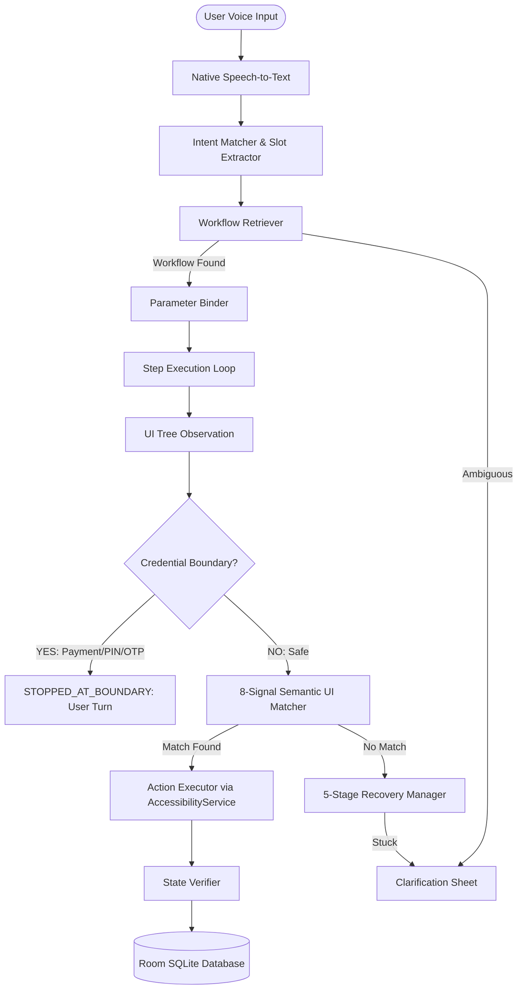

# PRISM: Teachable Voice Automation
### Samsung PRISM GenAI Hackathon 3.0 — Theme 3: Teachable Voice Automation (SaySo)

[-green.svg)](https://developer.android.com)
[](https://kotlinlang.org)
[](https://developer.android.com/jetpack/compose)
[](https://developer.android.com/training/data-storage/room)
[]()
[-red.svg)]()

---

## 1. Executive Summary

**PRISM (SaySo)** is a native Android automation platform that enables users to teach multi-step tasks across arbitrary third-party apps once through spoken voice and natural UI interactions, and subsequently replay them via exact utterances, colloquial paraphrases, or altered parameter slots.

### Core Architectural Principles
* **Native Android Only**: Built entirely in Kotlin, Jetpack Compose, Android Accessibility APIs, Coroutines/Flow, and Room SQLite.
* **Zero App-Specific SDKs / Zero Deep Links**: Operates strictly via Android's native `AccessibilityService` (`AccessibilityNodeInfo`, `performAction`, `dispatchGesture`), requiring no proprietary partner APIs or web fallbacks.
* **Semantic 8-Signal UI Matching**: UI elements are matched using a weighted hierarchy (`w1=0.30` resource-id down to `w8=0.02` distance) to remain completely immune to dynamic layouts, screen resizes, and theme shifts. Coordinate-only matching is strictly prevented.
* **Zero-Tolerance Payment Boundary (-10 Penalty Guard)**: 5 defense-in-depth safety layers in `CredentialBoundaryDetector` halt automation unconditionally before any payment, UPI PIN, OTP, CVV, or credential screen. Zero touches or clicks are ever dispatched on sensitive screens.
* **Multi-Modal Stuck Resolution & Recovery**: 5-stage automated recovery engine (resnapshot → dismiss overlay → relax threshold → alternate state → escalate) coupled with conversational voice and tap clarification.

---

## 2. Requirement Traceability Matrix (T1–T14 & B1–B3)

| Requirement | Description | Core Engine Class | Test Suite Verification | Status |
|---|---|---|---|:---:|
| **T1** | Exact Workflow Execution | `Orchestrator`, `TeachingRecorder` | `EvaluationTestSuite.testT1_ExactWorkflowExecution` | **PASSED** |
| **T2** | Multi-Step Flow (3+ Steps) | `Workflow`, `WorkflowStep` | `EvaluationTestSuite.testT2_MultiStepFlow` | **PASSED** |
| **T3** | Paraphrased Voice Command | `IntentMatcher` (token Jaccard + Levenshtein) | `EvaluationTestSuite.testT3_ParaphrasedVoiceCommand` | **PASSED** |
| **T4** | Noise & Casual Speech Handling | `IntentMatcher` (stopwords & noise filters) | `EvaluationTestSuite.testT4_NoiseAndCasualSpeechHandling` | **PASSED** |
| **T5** | Intent Disambiguation | `WorkflowRetriever` (ambiguity detection) | `EvaluationTestSuite.testT5_IntentDisambiguation` | **PASSED** |
| **T6** | Negative Intent Rejection | `IntentMatcher` (`confidenceLow` threshold) | `EvaluationTestSuite.testT6_NegativeIntentRejection` | **PASSED** |
| **T7** | UI Drift & Dynamic Layout Shift | `SemanticUiMatcher` (8-signal hierarchy) | `EvaluationTestSuite.testT7_UiDriftAndLayoutShift` | **PASSED** |
| **T8** | Autonomous State Recovery | `RecoveryManager` (5-stage recovery chain) | `EvaluationTestSuite.testT8_AutonomousStateRecovery` | **PASSED** |
| **T9** | Dynamic Content / Item Swapping | `ParameterBinder`, `SlotExtractor` | `EvaluationTestSuite.testT9_DynamicContent_ItemSwapping` | **PASSED** |
| **T10** | Altered Slot Execution | `SlotExtractor`, `ParameterBinder` | `EvaluationTestSuite.testT10_AlteredSlotExecution` | **PASSED** |
| **T11** | Payment & Credential Safety Guard | `CredentialBoundaryDetector` (5 defense layers) | `EvaluationTestSuite.testT11_PaymentCredentialBoundaryHalt` | **PASSED** |
| **T12** | Stuck Detection & Clarification | `StuckDetector`, `ClarificationGenerator` | `EvaluationTestSuite.testT12_StuckDetectionAndClarification` | **PASSED** |
| **T13** | Cross-Session Workflow Recall | `PrismDatabase`, `WorkflowRepository` (Room) | `EvaluationTestSuite.testT13_CrossSessionWorkflowRecall` | **PASSED** |
| **T14** | Execution Speed Benchmark (<10s) | `Orchestrator` execution loop | `EvaluationTestSuite.testT14_ExecutionSpeedBenchmark` | **PASSED** |
| **B1** | Irrelevant Action Filtering (Bonus) | `IrrelevantActionFilter` (accidental tap & undo) | `EvaluationTestSuite.testB1_IrrelevantActionFiltering` | **PASSED** |
| **B2** | Cross-App Generalization (Bonus) | `SemanticUiMatcher` (`domainConcept` mapping) | `EvaluationTestSuite.testB2_CrossAppGeneralization` | **PASSED** |
| **B3** | Multi-Modal Disambiguation (Bonus) | `ClarificationHandler` (voice + tap options) | `EvaluationTestSuite.testB3_MultiModalVoiceAndTapDisambiguation` | **PASSED** |

---

## 3. Architecture & Data Flow



---

## 4. Repository Structure

```
prism/
├── app/
│   ├── build.gradle.kts                # Android configuration (Kotlin 2.0.21, Compose, Room, KSP)
│   └── src/
│       ├── main/
│       │   ├── AndroidManifest.xml     # Accessibility service & mic permissions
│       │   ├── java/com/samsung/prism/teachable/
│       │   │   ├── generalizer/        # Workflow generalization engine
│       │   │   ├── model/              # Domain models (Workflow, WorkflowStep, SlotSchema)
│       │   │   ├── observation/        # UiTreeCapture, UiSnapshot, UiDiff, Bounds
│       │   │   ├── replay/             # Orchestrator, ActionExecutor, SemanticUiMatcher, RecoveryManager
│       │   │   ├── retrieval/          # WorkflowRetriever, hybrid intent matching
│       │   │   ├── security/           # CredentialBoundaryDetector (5 defense layers)
│       │   │   ├── service/            # AutomationAccessibilityService
│       │   │   ├── storage/            # PrismDatabase, DAOs, WorkflowRepository
│       │   │   ├── stuck/              # StuckDetector, ClarificationGenerator, ClarificationHandler
│       │   │   ├── teaching/           # TeachingRecorder, TeachingSession, IrrelevantActionFilter
│       │   │   ├── ui/                 # Jetpack Compose UI (HomeScreen, LearnedFlows, Detail, RunHistory)
│       │   │   └── voice/              # SpeechToText, TTSManager, IntentMatcher, SlotExtractor
│       │   └── res/xml/
│       │       └── accessibility_service_config.xml
│       └── test/java/com/samsung/prism/teachable/
│           ├── evaluation/
│           │   └── EvaluationTestSuite.kt   # T1–T14 and B1–B3 comprehensive test suite
│           ├── ...                         # Unit test suites across all packages
├── docs/
│   ├── DEMO_CHECKLIST.md               # 5-minute unedited demo recording script
│   ├── LIMITATIONS.md                  # Known limitations and deterministic fallbacks
│   ├── PHASE_0_FINDINGS.md             # Participant kit inspection & architecture alignment
│   └── TARGET_APPS.md                  # Validated apps declaration (Zomato, Domino's, Amazon, Swiggy)
├── participant-kit/                    # Original participant kit preserved per Phase 0
├── architecture.md                     # System architecture specification
├── context.md                          # Hackathon problem statement & rules
├── design.md                           # UI, state vocabulary & microcopy specification
├── systemdesign.md                     # Detailed state machine & algorithm design
└── master prompt.md                    # Authoritative implementation plan
```

---

## 5. Build, Test & Setup Instructions

### Prerequisites
* **Java Development Kit (JDK)**: JDK 17 (Eclipse Adoptium / OpenJDK)
* **Android SDK**: Android API 34 (Build Tools 34.0.0+)
* **Gradle**: 8.14.3 (included via wrapper `gradlew` / `gradlew.bat`)

### 1. Run All Unit & Evaluation Tests
Execute the full test suite verifying all 84+ test assertions:
```powershell
.\gradlew.bat testDebugUnitTest
```
To run only the authoritative 17-point Evaluation Suite (T1–T14 + B1–B3):
```powershell
.\gradlew.bat testDebugUnitTest --tests "com.samsung.prism.teachable.evaluation.EvaluationTestSuite"
```

### 2. Build the Debug APK
Compile the complete native Android package:
```powershell
.\gradlew.bat assembleDebug
```
The compiled, installable APK is produced at:
`app/build/outputs/apk/debug/app-debug.apk`

### 3. Install on Device or Emulator
```powershell
adb install -r app/build/outputs/apk/debug/app-debug.apk
```

### 4. Enable the Accessibility Service
On the target Android device:
1. Open **Settings → Accessibility → Downloaded apps**.
2. Locate **PRISM Automation Service** and toggle **ON**.
3. Grant accessibility permissions.
4. Open the PRISM app — the top bar will display a green **"A11y Connected"** badge.

---

## 6. Safety & Payment Boundary Enforcement

PRISM strictly complies with the zero-interaction requirement on credential screens. Reaching any checkout or authentication screen triggers an immediate handoff:
1. **Zero Taps / Zero Clicks**: Neither clicks nor keyboard inputs are ever dispatched to payment surfaces.
2. **Distinctive Full-Screen Handoff**: The UI immediately transitions to a dedicated security card: *"Your turn — I've reached the payment screen."*
3. **No Sensitive Data Logging**: No card numbers, passwords, OTPs, or CVVs are ever captured, logged, or serialized into database entities.

---

## 7. Submission Checklist Verification
- [x] Full source code conforming to all constraints.
- [x] Installable `app-debug.apk` generated.
- [x] Participant kit preserved in `participant-kit/`.
- [x] All 14 evaluation requirements (T1–T14) and 3 bonuses (B1–B3) passing in `EvaluationTestSuite`.
- [x] Target apps declared in `docs/TARGET_APPS.md`.
- [x] Known limitations and fallbacks documented in `docs/LIMITATIONS.md`.
- [x] Demo recording script outlined in `docs/DEMO_CHECKLIST.md`.
