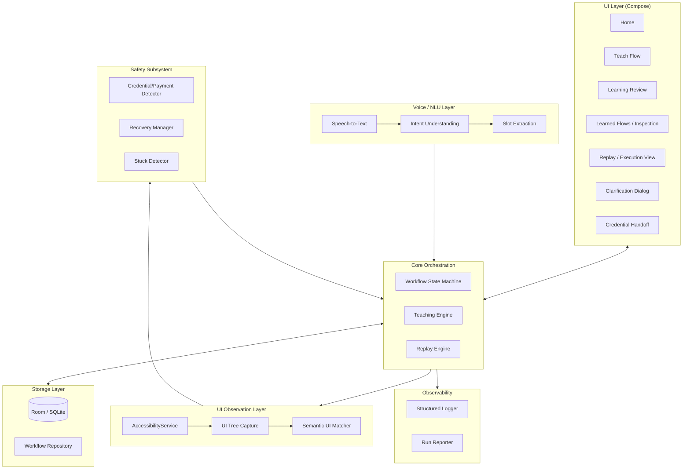
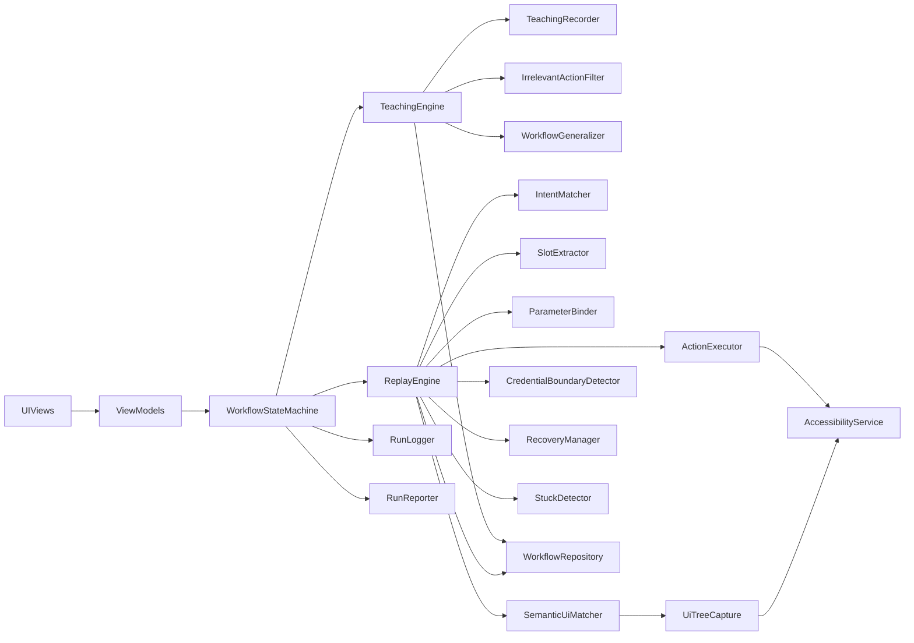
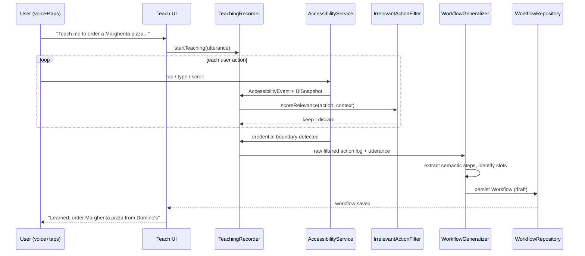
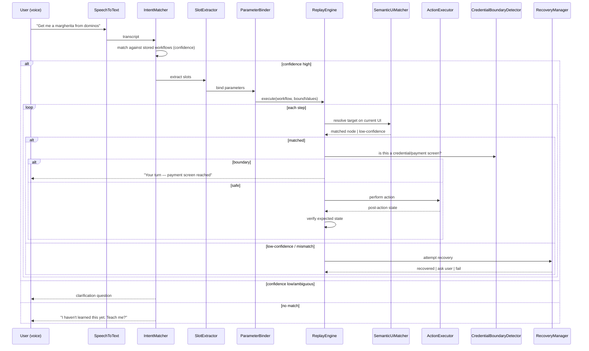
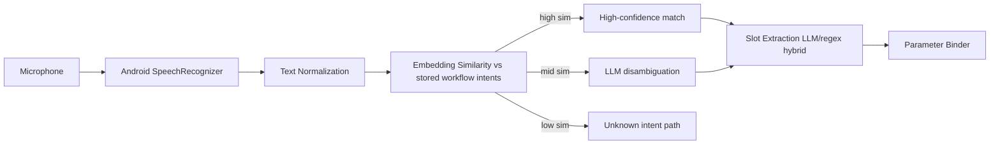
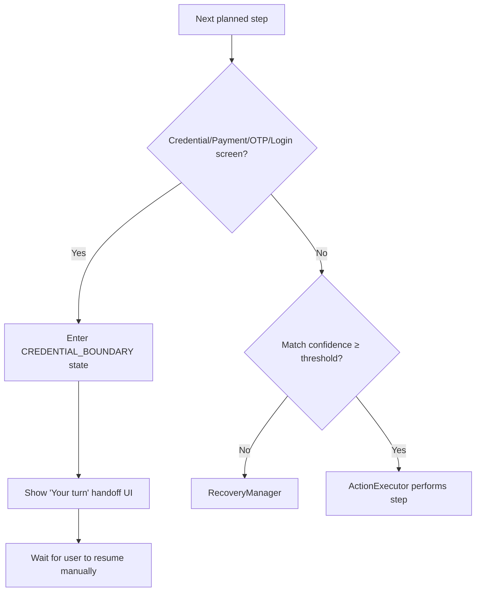

# architecture.md
## Structural Blueprint — Teachable Voice Automation (Samsung PRISM Theme 3)

This document defines **how the system is structured**. See `context.md` for requirements, `systemdesign.md` for detailed behavior/algorithms, `design.md` for UI/UX.

---

## 1. High-Level Architecture

---

## 2. Component Architecture

### 2.1 Component Inventory

| Component | Responsibility | Layer |
|---|---|---|
| `AccessibilityService` (`AutomationAccessibilityService`) | System-level hook for UI tree read + gesture/node dispatch | Android |
| `UiTreeCapture` | Snapshots current `AccessibilityNodeInfo` tree into an internal `UiSnapshot` model | UI Observation |
| `SemanticUiMatcher` | Scores/selects best-matching node on current screen against a stored `StepTarget` | UI Observation |
| `ActionExecutor` | Dispatches taps/text-input/scroll via Accessibility gestures against a resolved node | UI Observation |
| `TeachingRecorder` | Listens to accessibility events during TEACHING state, builds raw action log | Teaching |
| `IrrelevantActionFilter` | Scores each recorded action for workflow relevance, discards noise | Teaching |
| `WorkflowGeneralizer` | Converts filtered raw actions + utterance into a generalized `Workflow` (semantic steps + slots) | Teaching |
| `SpeechToText` | Android `SpeechRecognizer` wrapper → text transcript | Voice |
| `IntentMatcher` | Embedding/LLM-assisted classification of transcript against stored workflow intents | Voice |
| `SlotExtractor` | Extracts entity values (item, quantity, address, search term, platform, restaurant) from transcript | Voice |
| `ParameterBinder` | Binds extracted slot values into a specific workflow's parameter set for a given run | Core |
| `WorkflowStateMachine` | Central FSM governing TEACH/READY/REPLAY/RECOVERY/ASK/BOUNDARY states | Core |
| `CredentialBoundaryDetector` | Deterministic classifier for payment/OTP/password/login screens | Safety |
| `RecoveryManager` | Bounded strategies to reconcile expected vs. observed UI state | Safety |
| `StuckDetector` | Timeout/retry-budget tracker that triggers ASK_USER or FAIL | Safety |
| `WorkflowRepository` | Room DAO + repository abstraction over persisted workflows/runs | Storage |
| `RunLogger` | Structured, per-step logging for developer debugging | Observability |
| `RunReporter` | Aggregates last-run status/step for T14 reporting | Observability |

### 2.2 Component Dependency Graph

---

## 3. Android Architecture

- **Language:** Kotlin.
- **UI:** Jetpack Compose (Material 3), single-Activity + navigation graph.
- **Concurrency:** Kotlin Coroutines + Flow throughout; no blocking calls on the accessibility event thread.
- **Background execution:** `AutomationAccessibilityService` (bound, system-managed) is the only privileged automation surface. A `ForegroundService` hosts the long-running Replay Engine execution loop when the app UI is backgrounded, with a persistent notification (required for user transparency and Android background execution limits).
- **Persistence:** Room (SQLite) — see §7 Storage Architecture in `systemdesign.md` for schema.
- **DI:** Manual or lightweight (Hilt) dependency wiring between layers — implementation detail, not prescribed further here; Antigravity should choose based on what compiles fastest and cleanest for a hackathon timeline.
- **Permissions required:** `BIND_ACCESSIBILITY_SERVICE`, `RECORD_AUDIO`, foreground service permission, `QUERY_ALL_PACKAGES` or targeted package visibility as needed to detect installed target apps.
- **No usage of:** private/reflective APIs, app-specific SDKs, WebView-based automation, deep link intents as an execution substitute.

---

## 4. AI Architecture

Per **context.md §5/§18 (Anti-Hard-Coding Rule, AI/LLM tradeoffs)**, the system splits deterministic vs. AI-assisted responsibilities:

**Deterministic (no LLM):**
- State machine transitions and guards.
- Credential/payment boundary detection (rule-based on resource-id/text/input-type/class signatures — must be deterministic, since T11 failure costs −10).
- Retry/timeout/stuck budget enforcement.
- Coordinate-fallback resolution.
- Persistence and schema validation.

**AI-assisted (LLM / embeddings):**
- Natural-language intent understanding (mapping transcript → candidate workflow, with confidence).
- Semantic slot extraction (entity parsing from free-form utterance).
- Paraphrase understanding (embedding similarity + LLM disambiguation for borderline cases).
- Semantic UI matching tie-breaking when deterministic signal scores are close (see `systemdesign.md` §UI Matching Algorithm).
- Recovery reasoning (proposing a specific clarification question, not just "error").
- Workflow summarization for the "Learned: ..." confirmation microcopy.

**Rationale:** Safety-critical and latency-critical paths (credential boundary, action execution, retries) must never depend on a network call or non-deterministic model output. Understanding/matching paths, where flexibility and generalization directly determine T3/T4/T5/T6/T9 scores, benefit from LLM-assisted reasoning and are architected as swappable, cache-fronted, timeout-bounded calls (see `systemdesign.md` §Performance Strategy).

---

## 5. Teaching Architecture

---

## 6. Replay Architecture

---

## 7. UI Observation Architecture

- `AutomationAccessibilityService` subscribes to `TYPE_WINDOW_STATE_CHANGED`, `TYPE_WINDOW_CONTENT_CHANGED`, and `TYPE_VIEW_CLICKED` events (throttled — see Performance Strategy in `systemdesign.md`).
- On each relevant event, `UiTreeCapture` walks the active window's `AccessibilityNodeInfo` root and produces a lightweight `UiSnapshot`: a serializable tree of `UiNode { resourceId, text, contentDescription, className, bounds, clickable, isPassword, inputType, children, packageName }`.
- Snapshots are diffed against the previous snapshot to detect state transitions (used both for teaching step boundaries and replay state verification).
- `UiSnapshot`s are never persisted with raw pixel data; only structural/semantic fields are stored, per the Storage Architecture privacy goals.

---

## 8. Workflow Representation (Summary — full schema in systemdesign.md)

Each learned workflow is stored as a structured object containing: workflow ID, natural-language intent, supported app/package(s), original utterance, generalized intent representation, slots/parameters, ordered semantic steps (each with multi-signal `StepTarget`), preconditions, UI state signatures, action semantics, expected state transitions, verification conditions, safety boundaries, failure/recovery strategies, and metadata/timestamps/version. Coordinates are stored **only** as a last-resort fallback field on each step, never as the primary locator. See `systemdesign.md` §"Data Models" for the full schema.

---

## 9. Storage Architecture

- **Engine:** Room over SQLite — chosen for offline reliability, low latency, easy inspection (`adb` / in-app DB viewer), and no dependency on network availability during a live demo.
- **Tables (summary):** `workflows`, `workflow_steps`, `workflow_slots`, `runs`, `run_steps`, `app_registry`. Full schema in `systemdesign.md` §Persistence Schema.
- Workflow JSON blobs (semantic step representation) are stored alongside normalized columns used for fast intent-candidate lookup (package name, intent tag).
- No credentials, passwords, OTP values, or payment details are ever written to storage, by construction (the Credential Boundary Detector halts the pipeline before any such screen is even snapshotted for step-recording purposes beyond boundary-detection metadata).

---

## 10. Voice Architecture

---

## 11. Recovery Architecture

`RecoveryManager` is invoked whenever `SemanticUiMatcher` returns a low-confidence result or `ActionExecutor`'s post-action state verification fails. It runs a bounded, ordered strategy chain (full detail in `systemdesign.md` §Recovery Engine):

1. Re-snapshot UI (transient loading state?).
2. Check for known dismissible overlays (popup/toast) safe to close.
3. Re-run semantic matching with relaxed thresholds / alternate signals.
4. Compare against alternate expected states (e.g., "item already in cart" branch).
5. If still unresolved within retry budget → escalate to `StuckDetector` → `ASK_USER` state with a *specific* generated question.

Recovery is always bounded (max retries, max wall-clock time) — infinite loops are architecturally prohibited by the state machine's guard conditions.

---

## 12. Safety Architecture

`CredentialBoundaryDetector` runs as a **mandatory pre-check before every single action dispatch**, not just once per screen — this guards against mid-screen state changes (e.g., a payment field appearing after a scroll). Detection signals: `isPassword` node flag, `inputType` (numeric OTP-style, password), resource-id/text keyword heuristics (password, otp, pin, cvv, card number, pay now, login, sign in), and package-declared secure-screen flags where available. This subsystem is purely deterministic (§4).

---

## 13. Data Flow (End-to-End)

See §6 (Replay) and §5 (Teaching) sequence diagrams above — together they constitute the complete data flow described conceptually in `context.md` §5's two flow diagrams (voice→execution, and teach→storage).

---

## 14. Deployment / Runtime Architecture

- Single APK, single process, with `AutomationAccessibilityService` as a declared service component and a `ForegroundService` for active replay runs.
- All AI calls (LLM/embedding) are made from a `NetworkAiClient` behind an interface (`IIntentUnderstanding`), allowing a local/deterministic fallback (keyword + Levenshtein/embedding-lite matching) if network/LLM is unavailable — ensuring the app remains demoable offline for the deterministic core paths (T11 safety boundary, T2 exact replay) even under degraded AI conditions.
- Runtime target: single physical/emulated Android device used for both teaching and replay in the demo; no multi-device sync required.

---

## 15. Integration with Participant Kit

Per `context.md` §4 and the mandatory Phase 0 inspection step in `master prompt.md`: the provided `participant-kit/` (`agent/`, `harness/`, `scenarios/`, `docs/PROTOCOL.md`, `SCORING.md`, `SUBMISSION.md`, `TOOLS.md`) must be read and understood before any implementation begins. Where the harness's protocol/scoring conventions (e.g., scenario JSON format, `runner.py`/`scorer.py` interfaces) are compatible with this Android architecture, the Android app's run-reporting (`RunReporter`) and test scenarios should be structured so they can be validated against or adapted from the same scenario/scoring conventions, rather than inventing a parallel, incompatible testing format. Concrete integration points are determined during Phase 0 and documented in the repository's own `docs/` as findings — this file records the *principle*, not invented specifics not present in the provided materials.
